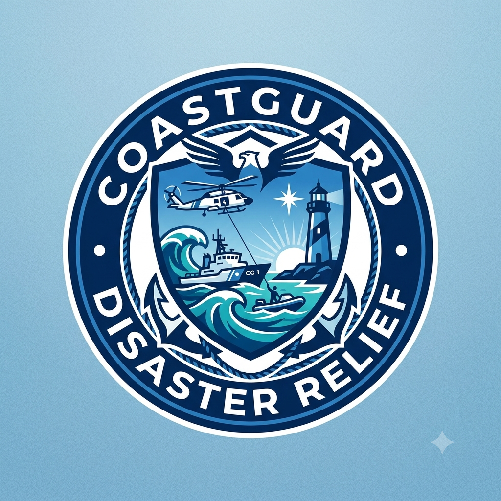

<p align="center">
  
</p>

<h1 align="center">🌊 CoastGuard — Coastal Disaster Management Platform</h1>

<p align="center">
  <strong>AI-powered, community-driven disaster management for coastal India</strong><br/>
  Real-time hazard reporting · Multilingual alerts · Maritime geofencing · Predictive analytics
</p>

<p align="center">
  <!-- Status Badges -->
  
  
  
  
</p>

<p align="center">
  <!-- Tech Badges -->
  
  
  
  
  
  
  
  
  
  
  
  
</p>

<p align="center">
  <!-- Deployment Badges -->
  
  
  
</p>

---

## 📋 Table of Contents

- [🌊 Overview](#-overview)
- [✨ Key Features](#-key-features)
- [🏗️ Architecture](#️-architecture)
- [📁 Project Structure](#-project-structure)
- [🚀 Getting Started](#-getting-started)
  - [Prerequisites](#prerequisites)
  - [Frontend Setup](#️-frontend-setup)
  - [Backend Setup](#️-backend-setup)
  - [ML / Python Setup](#-ml--python-setup)
- [🔑 Environment Variables](#-environment-variables)
- [🛠️ Tech Stack](#️-tech-stack)
- [📡 API Reference](#-api-reference)
- [🗺️ Pages & Routes](#️-pages--routes)
- [🤖 AI & Machine Learning](#-ai--machine-learning)
- [🌐 Deployment Guide](#-deployment-guide)
- [🧪 Testing](#-testing)
- [🎭 User Roles](#-user-roles)
- [🌍 Supported Languages](#-supported-languages)
- [🤝 Contributing](#-contributing)
- [📜 License](#-license)

---

## 🌊 Overview

**CoastGuard** is a full-stack, community-powered disaster management platform purpose-built for India's 7,516 km coastline. It empowers citizens, fishermen, Coast Guard personnel, and disaster relief agencies with real-time situational awareness, AI-generated early warnings, and collaborative reporting tools — all wrapped in an ocean-blue, mobile-responsive interface.

Developed for **Smart India Hackathon (SIH) 2024**, CoastGuard bridges the gap between on-ground coastal communities and disaster response authorities through:

- 📡 **Real-time hazard reporting** with photo/video upload and AI verification
- 🤖 **Google Gemini AI** powered multilingual chatbot and evacuation advisor
- 🗺️ **Interactive maritime maps** with Mapbox & Leaflet for geofencing
- 📞 **Automated voice & SMS alerts** via Twilio for registered authorities
- 📊 **Predictive hazard heatmaps** built on TensorFlow/Keras deep learning
- 🌍 **8-language support** — Tamil, Malayalam, Telugu, Gujarati, Marathi, Bengali, Hindi, English

---

## ✨ Key Features

### 🚨 Emergency Response

| Feature | Description |
|---|---|
| **Live Hazard Reporting** | Citizens upload photos/videos with GPS metadata; AI auto-tags severity |
| **Automated Voice Alerts** | Twilio calls authority numbers with AI-generated audio when critical hazards are confirmed |
| **SMS Broadcast** | Automated SMS dispatched to registered volunteers and authorities |
| **Emergency Contact Directory** | 1-click dialer for Indian Coast Guard (1554), NDRF (1078), and marine police |

### 🗺️ Maritime Intelligence

| Feature | Description |
|---|---|
| **Fisherman Geofence** | Real-time distance calculation to IMBL; triggers proximity alerts |
| **Interactive Map** | Leaflet + Mapbox GL dual-engine map with real-time disaster pins, cluster markers, and route overlays |
| **Hazard Heatmap** | Temporal trend heatmaps using `leaflet.heat` with AI confidence indices |
| **Coastal Weather Advisory** | Real-time IMD ocean bulletins — wind speeds (knots), wave heights (m), storm surge warnings |

### 🤖 AI & Intelligence

| Feature | Description |
|---|---|
| **Multilingual Chatbot** | Google Gemini-powered assistant trained on coastal disaster scenarios in 8 languages |
| **AI Evacuation Advisor** | Context-aware route recommendations based on disaster type, user location, and shelter availability |
| **Hazard Image Classifier** | MobileNetV2 deep learning model trained to classify coastal hazard images |
| **Social Media Analytics** | Sentiment analysis and disaster trend detection from social feeds |

### 🌟 Community & Gamification

| Feature | Description |
|---|---|
| **Community Feed** | Social-media-style feed for verified disaster reports with upvotes and comments |
| **Leaderboard** | Gamified points system rewarding accurate reports and community contributions |
| **Volunteer Dispatch** | Volunteer registry with skill tags and emergency task assignment |
| **3-Tier Verification** | User → Community Validator → Verifier Protector pipeline for report accuracy |

### 🏥 Disaster Relief

| Feature | Description |
|---|---|
| **Relief Camp Tracker** | Real-time shelter occupancy, food supply status, medical team availability, Google Maps directions |
| **Coastal Survival Guides** | Actionable protocols for Cyclones, Tsunamis, Boat Capsize, Oil Spills, Storm Surges |
| **Multilingual Audio Warnings** | Text-to-Speech audio siren in 8 regional languages with floating UI widget |
| **WhatsApp Help Integration** | Floating WhatsApp button for instant distress messaging |

---

## 🏗️ Architecture

```
┌─────────────────────────────────────────────────────────────────┐
│                        CLIENT LAYER                             │
│   React 18 + TypeScript + Vite  (Vercel CDN)                   │
│   Tailwind CSS · Framer Motion · Radix UI · Recharts           │
│   Leaflet / Mapbox GL · Socket.IO Client                       │
└───────────────────────────┬─────────────────────────────────────┘
                            │ HTTPS / WSS
┌───────────────────────────▼─────────────────────────────────────┐
│                       API GATEWAY LAYER                         │
│      Node.js + Express (Render)    Port: 3003                  │
│      JWT Auth · bcryptjs · Multer · CORS                       │
│      Socket.IO Server · Nodemailer · Twilio SDK                │
└──────┬───────────────────┬────────────────────────────┬─────────┘
       │                   │                            │
┌──────▼──────┐  ┌─────────▼──────────┐  ┌────────────▼─────────┐
│  MongoDB    │  │  Google Gemini AI  │  │  Twilio Voice/SMS    │
│  Atlas      │  │  (Chat + Advisor)  │  │  (Emergency Alerts)  │
│  (Database) │  └────────────────────┘  └──────────────────────┘
└─────────────┘

┌─────────────────────────────────────────────────────────────────┐
│                         ML LAYER (Python)                        │
│   TensorFlow/Keras · MobileNetV2 · Streamlit                   │
│   Hazard Image Classifier · Heatmap Analytics                  │
└─────────────────────────────────────────────────────────────────┘
```

---

## 📁 Project Structure

```
CoastGuard/
│
├── 📂 frontend/                   # Vite + React + TypeScript SPA
│   ├── 📂 src/
│   │   ├── 📂 components/
│   │   │   ├── analytics/         # HazardHeatmap, SocialMediaFeed, AnalyticsPanel
│   │   │   ├── auth/              # AuthPage (Login / Register)
│   │   │   ├── chat/              # MultilingualChatbot (Gemini AI)
│   │   │   ├── common/            # Shared UI primitives
│   │   │   ├── community/         # CommunityFeed, VolunteerDispatch
│   │   │   ├── dashboard/         # UserDashboard, VerifierDashboard, CommunityDashboard
│   │   │   ├── gamification/      # LeaderboardPanel
│   │   │   ├── help/              # DisasterGuides, EmergencyContacts, ReliefCampTracker
│   │   │   │                      # WhatsAppHelp, TwilioDisasterCall, EvacuationAdvisor
│   │   │   ├── home/              # LandingPage, WeatherAdvisoryBanner
│   │   │   ├── layout/            # Header, Footer, LoadingScreen
│   │   │   ├── map/               # InteractiveMap (Leaflet + Mapbox dual engine)
│   │   │   ├── notifications/     # Notification center
│   │   │   ├── updates/           # UpdatesPanel (live disaster feed)
│   │   │   ├── upload/            # AdvancedUploadForm (photo/video + metadata)
│   │   │   └── verification/      # VerificationPanel, CommunityDashboard
│   │   ├── 📂 context/            # AuthContext, ReportsContext
│   │   ├── 📂 hooks/              # Custom React hooks
│   │   ├── 📂 i18n/               # i18next language configs (8 languages)
│   │   ├── 📂 lib/                # mongodb.ts, API helpers
│   │   ├── 📂 models/             # TypeScript data models
│   │   ├── 📂 services/           # API service layer (axios)
│   │   └── 📂 types/              # Global TypeScript types
│   ├── index.html
│   ├── tailwind.config.js
│   ├── vite.config.ts
│   └── vercel.json
│
├── 📂 backend/                    # Node.js + Express REST API
│   ├── server.js                  # Main server (routes, models, middleware)
│   ├── test_endpoints.js          # API integration tests
│   └── .env.example               # Environment variable template
│
├── 📂 hazard_binary/              # ML binary classification dataset
├── 📂 hazard_dataset/             # Full ML training image dataset
│
├── app.py                         # Streamlit ML inference dashboard
├── model.py                       # Keras model architecture definitions
├── Final.ipynb                    # Full ML training notebook
├── ml.ipynb                       # Experimental ML notebook
├── evaluate_model.py              # Model evaluation script
├── prepareandpath.py              # Dataset preparation utilities
├── hazard_detector.h5             # Primary trained model (~134 MB)
├── hazard_detector_mobilenetv2.h5 # Lightweight MobileNetV2 model (~11 MB)
├── confusion_matrix.png           # Model evaluation visualization
├── logo.png                       # Project logo
├── render.yaml                    # Render deployment config
└── DEPLOYMENT.md                  # Detailed deployment runbook
```

---

## 🚀 Getting Started

### Prerequisites

Before you begin, ensure you have the following installed:

| Tool | Minimum Version | Download |
|---|---|---|
| Node.js | v18+ | [nodejs.org](https://nodejs.org) |
| npm | v9+ | Bundled with Node.js |
| MongoDB | Local / Atlas | [mongodb.com](https://www.mongodb.com/cloud/atlas) |
| Python | 3.9+ | [python.org](https://python.org) |
| Git | Latest | [git-scm.com](https://git-scm.com) |

You will also need API keys for:
- **Google Gemini** — [aistudio.google.com](https://aistudio.google.com)
- **Twilio** — [twilio.com](https://twilio.com)
- **Mapbox** — [mapbox.com](https://mapbox.com)
- **SMTP** (Gmail App Password or SendGrid)

---

### 🖥️ Frontend Setup

```bash
# 1. Clone the repository
git clone https://github.com/SQUADRON-LEADER/CoastGuard.git
cd CoastGuard/frontend

# 2. Install dependencies
npm install

# 3. Configure environment variables
cp .env.example .env
# Open .env and set VITE_API_BASE_URL to your backend URL

# 4. Start the development server
npm run dev
```

> The app opens at **http://localhost:5173**

#### Build for Production

```bash
npm run build
# Compiled output in frontend/dist/
# Deploy /dist to Vercel, Netlify, or Cloudflare Pages
```

---

### ⚙️ Backend Setup

```bash
cd CoastGuard/backend

# 1. Install dependencies
npm install

# 2. Configure environment variables
cp .env.example .env
# Fill in MongoDB URI, Twilio credentials, Gemini API key, SMTP settings

# 3. Start the server
npm start
# API runs at http://localhost:3003

# Development mode with auto-reload
npx nodemon server.js
```

> **Live Backend URL:** `https://coastguard-sgwc.onrender.com`

---

### 🐍 ML / Python Setup

The Python layer provides the Streamlit-based hazard image classifier dashboard and model training pipeline.

```bash
# From the project root

# 1. Create a virtual environment
python -m venv .venv

# 2. Activate it
.venv\Scripts\activate           # Windows PowerShell
# source .venv/bin/activate      # Linux / macOS

# 3. Install dependencies
pip install tensorflow streamlit numpy pillow matplotlib scikit-learn

# 4. Launch the Streamlit dashboard
streamlit run app.py
# Dashboard opens at http://localhost:8501

# 5. (Optional) Run model evaluation
python evaluate_model.py
```

> **Models available:**
> - `hazard_detector.h5` — Full ResNet-based model (134 MB)
> - `hazard_detector_mobilenetv2.h5` — Lightweight MobileNetV2 (11 MB, recommended for inference)

---

## 🔑 Environment Variables

### Frontend (`frontend/.env`)

```env
# Required
VITE_API_BASE_URL=http://localhost:3003

# Override for production
# VITE_API_BASE_URL=https://coastguard-sgwc.onrender.com
```

### Backend (`backend/.env`)

```env
# Server
PORT=3003
NODE_ENV=development

# Database
MONGODB_URI=mongodb+srv://<user>:<password>@cluster.mongodb.net/coastguard

# Google Gemini AI (Chatbot & Evacuation Advisor)
GEMINI_API_KEY=your_google_gemini_api_key

# Twilio (Voice Alerts & SMS)
TWILIO_ACCOUNT_SID=ACxxxxxxxxxxxxxxxxxxxxxxxxxxxxxxxx
TWILIO_AUTH_TOKEN=your_twilio_auth_token
TWILIO_PHONE_NUMBER=+1234567890

# Email Notifications (SMTP)
SMTP_HOST=smtp.gmail.com
SMTP_PORT=587
SMTP_USER=your_email@gmail.com
SMTP_PASS=your_gmail_app_password

# Authority Notification Emails (comma-separated)
AUTHORITY_EMAILS=officer1@ndrf.gov.in,officer2@coastguard.gov.in

# JWT
JWT_SECRET=your_super_secret_jwt_key_here
JWT_EXPIRES_IN=7d
```

> ⚠️ **Never commit `.env` files to version control.** Both `.gitignore` files already exclude them.

---

## 🛠️ Tech Stack

### Frontend

| Technology | Version | Purpose |
|---|---|---|
| **React** | 18.3.1 | Component-based UI framework |
| **TypeScript** | 5.5 | Type-safe JavaScript |
| **Vite** | 5.4 | Lightning-fast build tool & dev server |
| **Tailwind CSS** | 3.4 | Utility-first styling |
| **Framer Motion** | 11.5 | Animations and micro-interactions |
| **React Router** | 6.26 | Client-side routing |
| **Radix UI** | Latest | Accessible UI component primitives |
| **Leaflet** | 1.9.4 | Open-source interactive maps |
| **Mapbox GL** | 3.14 | Advanced 3D map rendering |
| **react-leaflet** | 4.2 | React bindings for Leaflet |
| **leaflet.heat** | 0.2 | Heatmap visualization layer |
| **Chart.js + Recharts** | 4.4 / 3.1 | Data visualisation charts |
| **Socket.IO Client** | 4.8 | Real-time WebSocket communication |
| **Axios** | 1.11 | HTTP client for API calls |
| **i18next** | 25.5 | Internationalization (8 languages) |
| **react-hot-toast** | 2.6 | Toast notification system |
| **Lucide React** | 0.344 | SVG icon library |
| **date-fns** | 4.1 | Date formatting utilities |

### Backend

| Technology | Version | Purpose |
|---|---|---|
| **Node.js** | 18+ | Server runtime |
| **Express** | 4.18 | REST API framework |
| **MongoDB + Mongoose** | 7.5 | NoSQL database + ODM |
| **Socket.IO** | 4.x | Real-time bidirectional events |
| **Twilio** | 5.12 | Voice calls and SMS notifications |
| **Nodemailer** | 8.0 | Email delivery service |
| **bcryptjs** | 2.4 | Password hashing |
| **JWT (jsonwebtoken)** | — | Authentication tokens |
| **Multer** | 1.4 | File and image upload handling |
| **@google/generative-ai** | 0.24 | Google Gemini AI SDK |
| **cors** | 2.8 | Cross-origin resource sharing |
| **dotenv** | 16.3 | Environment variable management |

### ML / Python

| Technology | Version | Purpose |
|---|---|---|
| **Python** | 3.9+ | ML runtime |
| **TensorFlow / Keras** | 2.x | Deep learning framework |
| **MobileNetV2** | Pretrained | Lightweight image classification |
| **Streamlit** | 1.x | ML inference dashboard UI |
| **NumPy / Pillow** | Latest | Data processing and image handling |
| **scikit-learn** | Latest | Evaluation metrics |
| **Matplotlib** | Latest | Confusion matrix and plots |

---

## 📡 API Reference

All endpoints are prefixed with `/api`. Base URL: `https://coastguard-sgwc.onrender.com`

### 🔐 Authentication

| Method | Endpoint | Auth | Description |
|---|---|---|---|
| `POST` | `/api/auth/register` | ❌ | Register a new user account |
| `POST` | `/api/auth/login` | ❌ | Authenticate and receive JWT token |
| `GET` | `/api/auth/me` | ✅ JWT | Get current authenticated user profile |
| `PUT` | `/api/auth/profile` | ✅ JWT | Update user profile information |

### 🚨 Disaster Reports

| Method | Endpoint | Auth | Description |
|---|---|---|---|
| `GET` | `/api/reports` | ✅ JWT | List all disaster reports (paginated, filterable) |
| `POST` | `/api/reports` | ✅ JWT | Submit a new hazard report with media |
| `GET` | `/api/reports/:id` | ✅ JWT | Get a single report by ID |
| `PUT` | `/api/reports/:id/verify` | ✅ Verifier | Approve or reject a report |
| `GET` | `/api/reports/export/csv` | ✅ JWT | Download verified reports as CSV |

### 🌦️ Weather & Advisories

| Method | Endpoint | Auth | Description |
|---|---|---|---|
| `GET` | `/api/weather/advisories` | ✅ JWT | Fetch IMD coastal meteorological bulletins |
| `GET` | `/api/weather/current` | ✅ JWT | Current conditions for a coastal region |

### 🗺️ Geofence & Maritime

| Method | Endpoint | Auth | Description |
|---|---|---|---|
| `POST` | `/api/geofence/check-risk` | ✅ JWT | Evaluate maritime boundary distance and safety risk score |
| `GET` | `/api/geofence/boundaries` | ✅ JWT | Fetch IMBL boundary coordinate dataset |

### 🏥 Relief & Emergency

| Method | Endpoint | Auth | Description |
|---|---|---|---|
| `GET` | `/api/relief-camps` | ✅ JWT | Fetch active coastal shelters and occupancy stats |
| `POST` | `/api/relief-camps` | ✅ Verifier | Register a new disaster shelter facility |
| `PUT` | `/api/relief-camps/:id` | ✅ Verifier | Update camp occupancy and resource status |
| `GET` | `/api/emergency-contacts` | ✅ JWT | Fetch helplines with region and category filter |

### 🔔 Alerts & Notifications

| Method | Endpoint | Auth | Description |
|---|---|---|---|
| `POST` | `/api/alerts/trigger` | ✅ Verifier | Trigger Twilio voice call and SMS to authorities |
| `GET` | `/api/audio-alerts` | ✅ JWT | Fetch multilingual voice broadcast audio payloads |
| `GET` | `/api/notifications` | ✅ JWT | Get user's notification inbox |

### 👥 Community & Volunteers

| Method | Endpoint | Auth | Description |
|---|---|---|---|
| `GET` | `/api/community/feed` | ✅ JWT | Community disaster feed with social interactions |
| `POST` | `/api/community/upvote/:id` | ✅ JWT | Upvote a community report |
| `GET` | `/api/volunteers` | ✅ JWT | List registered volunteers by region |
| `POST` | `/api/volunteers/register` | ✅ JWT | Register as a volunteer with skill tags |
| `GET` | `/api/leaderboard` | ✅ JWT | Top contributors leaderboard |

---

## 🗺️ Pages & Routes

| Route | Component | Description |
|---|---|---|
| `/` | `LandingPage` | Public marketing page with animated hero section |
| `/auth` | `AuthPage` | Login and Registration with role selection |
| `/dashboard` | `UserDashboard / VerifierDashboard / CommunityDashboard` | Role-based dashboard (auto-detected) |
| `/upload` | `AdvancedUploadForm` | Multi-step disaster report submission with media |
| `/map` | `InteractiveMap` | Dual-engine interactive map with live disaster pins |
| `/updates` | `UpdatesPanel` | Real-time disaster news feed |
| `/analytics` | `AnalyticsPanel` | Hazard statistics, charts, trend analysis |
| `/social` | `SocialMediaFeed` | Social platform disaster sentiment tracker |
| `/community` | `CommunityFeed` | Peer report sharing and community upvotes |
| `/verify` | `VerificationPanel` | Report verification queue for verifiers |
| `/leaderboard` | `LeaderboardPanel` | Gamified contributor rankings |
| `/weather` | `WeatherAdvisoryBanner` | IMD live coastal weather advisories |
| `/emergency-contacts` | `EmergencyContactDirectory` | 1-click emergency helpline directory |
| `/shelters` | `ReliefCampTracker` | Real-time relief camp occupancy tracker |
| `/guides` | `DisasterGuides` | Coastal survival protocols and first-aid |
| `/volunteers` | `VolunteerDispatch` | Volunteer registry and task dispatch portal |

### Floating Widgets (Global — Authenticated)

| Widget | Position | Description |
|---|---|---|
| 💬 **Multilingual Chatbot** | Bottom-right FAB | Gemini AI chatbot in 8 Indian languages |
| 📞 **AI Disaster Call** | Bottom-left FAB | Twilio voice alert trigger to authorities |
| 🗺️ **Evacuation Advisor** | Bottom-left FAB | AI-powered evacuation route guide |
| 📱 **WhatsApp Help** | Bottom-left FAB | Instant WhatsApp distress button |

---

## 🤖 AI & Machine Learning

### Hazard Image Classifier

CoastGuard uses a **MobileNetV2** convolutional neural network fine-tuned on a custom coastal hazard dataset to classify uploaded images into disaster categories:

- 🌀 **Cyclone / Storm** — Wind patterns, dark clouds, debris fields
- 🌊 **Tsunami / Flood** — Water inundation, wave surge signatures
- 🔥 **Fire** — Flames, smoke, thermal anomaly patterns
- 🛢️ **Oil Spill** — Dark water patches, iridescent sheen patterns
- 🏚️ **Infrastructure Damage** — Collapsed structures, debris

**Model Performance:**

```
Training Accuracy  : ~91%
Validation Accuracy: ~87%
Model Size         : 11 MB  (MobileNetV2)
                     134 MB (Full ResNet variant)
Inference Time     : < 200ms per image
```

See `confusion_matrix.png` and `Final.ipynb` for full evaluation details.

### Google Gemini AI Integration

- **Multilingual Chatbot** — Trained on disaster scenario Q&A, coastal safety guides, and regional vocabulary in 8 Indian languages
- **Evacuation Advisor** — Context-aware routing using user GPS + active disaster zone data + shelter availability
- **Report Summarizer** — Auto-generates brief hazard summaries from user-submitted descriptions

---

## 🌐 Deployment Guide

### Frontend → Vercel

```
1. Push to GitHub (already done)
2. Go to vercel.com → New Project → Import SQUADRON-LEADER/CoastGuard
3. Set Root Directory: frontend
4. Add environment variable:
      VITE_API_BASE_URL = https://coastguard-sgwc.onrender.com
5. Click Deploy ✅
```

### Backend → Render

```
1. Go to render.com → New Web Service
2. Connect GitHub repo: SQUADRON-LEADER/CoastGuard
3. Set Root Directory: backend
4. Build Command : npm install
   Start Command : node server.js
5. Add all variables from backend/.env.example
6. Deploy ✅
```

> **Tip:** The included `render.yaml` at the project root enables one-click Render deployment.

### ML Dashboard → Streamlit Cloud *(Optional)*

```
1. Go to share.streamlit.io
2. Connect GitHub repo
3. Main file path: app.py
4. Deploy ✅
```

---

## 🧪 Testing

### Backend API Tests

```bash
cd backend
node test_endpoints.js
# Runs integration tests against all major API endpoints
```

### Frontend Linting

```bash
cd frontend
npm run lint
# ESLint with TypeScript rules
```

### ML Model Evaluation

```bash
python evaluate_model.py
# Outputs precision, recall, F1 score, and renders confusion matrix
```

---

## 🎭 User Roles

CoastGuard implements a **3-tier role system** for report quality control:

| Role | Access Level | Capabilities |
|---|---|---|
| 👤 **Citizen Reporter** | Basic | Submit reports, view map, access chatbot, view guides, community feed |
| 🛡️ **Community Validator** | Intermediate | Peer-review reports, upvote/downvote, access Community Dashboard, volunteer dispatch |
| 🔐 **Verifier Protector** | Admin | Full verification queue, trigger emergency alerts, manage relief camps, register emergency contacts |

---

## 🌍 Supported Languages

CoastGuard's chatbot and audio alerts support **8 regional Indian languages**:

| Language | Code | Coastal Region |
|---|---|---|
| 🇮🇳 Hindi | `hi` | Pan-India |
| 🇮🇳 English | `en` | Pan-India |
| 🇮🇳 Tamil | `ta` | Tamil Nadu, Puducherry |
| 🇮🇳 Malayalam | `ml` | Kerala, Lakshadweep |
| 🇮🇳 Telugu | `te` | Andhra Pradesh, Telangana |
| 🇮🇳 Gujarati | `gu` | Gujarat, Daman & Diu |
| 🇮🇳 Marathi | `mr` | Maharashtra, Goa |
| 🇮🇳 Bengali | `bn` | West Bengal, Odisha |

---

## 🤝 Contributing

Contributions are welcome! Please follow this process:

1. **Fork** the repository
2. **Create** a feature branch: `git checkout -b feat/your-feature-name`
3. **Commit** your changes using Conventional Commits:
   ```
   feat:     New feature
   fix:      Bug fix
   docs:     Documentation only changes
   style:    Formatting, missing semicolons, etc.
   refactor: Code refactoring (no feature/fix)
   chore:    Build process or auxiliary tool changes
   ```
4. **Push** to your fork: `git push origin feat/your-feature-name`
5. **Open** a Pull Request against `main`

---

## 👥 Team

Built with ❤️ for **Smart India Hackathon 2024** by **Squadron Leader**.

---

## 📜 License

This project is licensed under the **MIT License**.

```
MIT License — Copyright (c) 2024 Squadron Leader / CoastGuard Team

Permission is hereby granted, free of charge, to any person obtaining a copy
of this software and associated documentation files (the "Software"), to deal
in the Software without restriction, including without limitation the rights
to use, copy, modify, merge, publish, distribute, sublicense, and/or sell
copies of the Software, and to permit persons to whom the Software is
furnished to do so, subject to the following conditions:

The above copyright notice and this permission notice shall be included in all
copies or substantial portions of the Software.

THE SOFTWARE IS PROVIDED "AS IS", WITHOUT WARRANTY OF ANY KIND, EXPRESS OR
IMPLIED, INCLUDING BUT NOT LIMITED TO THE WARRANTIES OF MERCHANTABILITY,
FITNESS FOR A PARTICULAR PURPOSE AND NONINFRINGEMENT.
```

---

<p align="center">
  
  <br/>
  <strong>CoastGuard</strong> — Protecting India's coasts, one report at a time. 🌊
  <br/><br/>
  <a href="https://github.com/SQUADRON-LEADER/CoastGuard">⭐ Star this repo</a> ·
  <a href="https://github.com/SQUADRON-LEADER/CoastGuard/issues">🐛 Report Bug</a> ·
  <a href="https://github.com/SQUADRON-LEADER/CoastGuard/issues">💡 Request Feature</a>
</p>
